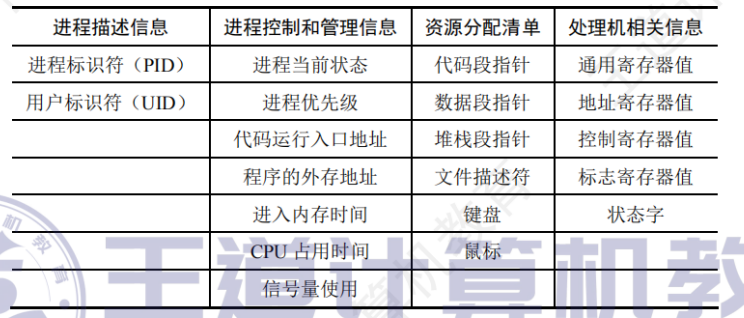
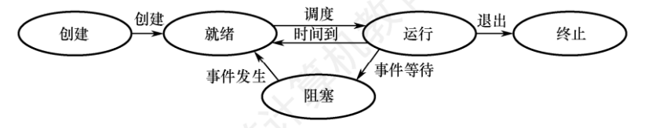

# 操作系统
## 进程和线程
我们使用进程控制块来描述进程的基本情况和允许状态
进程实体（也称为进程映像）包括：程序段，数据段，PCB

##### 进程的特性
- 动态性=》进程时程序的一次执行
- 并发性=》多个进程同存于内存
- 独立性=》进程时独立允许，独立获取资源的基本单位
- 异步性=》进程各自独立，不可预知的速度向前推进

##### 进程组成
- PCB=》进程创建的时候，操作系统为其创建一个PCB，此后该结构常驻内存，并在进程结束后删除

1. 进程描述信息：进程标识符：标识进程、用户标识符：标识所属用户
2. 进程控制和管理信息：描述进程当前状态，标识优先级
3. 资源分配清单：说明有关内存地址空间或者虚拟空间的情况
4. 处理及相关信息：也称CPU上下文，主要指的是CPU内部各个寄存器的值

note：我们通常采用链接方式或者索引方式来管理PCB
 - 链接方式：根据阻塞原因不同，排成多个阻塞队列
 - 索引方式：将同一个状态的进程组织在一个索引表中，不同表项执行对应的PCB

- 程序段：CPU执行的程序代码段
- 数据段：一个进程的数据段

##### 进程状态与切换
运行态，就绪态，阻塞态，创建态，终止态
- 这里说一下什么为创建态，这里你要清楚进程创建的步骤，在进程创建的时候，需要先申请PCB，然后向其中填写控制信息，随后分配资源，如果资源不足，就会等待资源，此时处于创建态，当得到资源的时候，初始化PCB，随后插入就绪队列

需要注意的是：进程从阻塞态变为就绪态是被动的行为，需要其它进程协助，但是就绪=》阻塞是主动的行为

##### 进程控制
一般称进程控制用的程序段为原语，原语的特点是执行期间不允许中断

- 运行一个进程创建另一个进程，此时创建者称为父进程，被创建者为子进程，子进程可以继承父进程所拥有的资源

进程终止
- 根据其标识符，检索对于PCB，然后读出该进程状态
- 如果处于运行态，立即终止该进程，然后将其CPU资源分配给其它进程
- 如果该进程还有子孙进程，一般需要将子孙进程终止
- 将该进程所拥有的全部资源归还父进程或者操作系统
- 删除其PCB

##### 进程阻塞与唤醒
- 进程使用阻塞原语（BLOCK）来使自己由运行态变为阻塞态（可见阻塞时一种主动行为）
- 当阻塞进程所期待的时间发生的时候，由有关进程调用唤醒原语（WAKEUP），将等待该事件的进程唤醒（被动行为）

##### 进程间的通信
匿名管道：最简单的IPC形式，在​​具有亲缘关系（通常是父子或兄弟）​​ 的进程间创建单工（半双工）字节流通道。数据写入管道的写入端，从读取端顺序读取（FIFO）。

命名管道：突破管道必须具有亲缘关系的限制，允许​​任何进程（甚至无亲缘关系）​​ 通过打开这个“文件”名进行通信。遵循FIFO原则。

消息队列：在内核中维护的​​消息链表​​。进程可以向队列添加​​结构化的消息​​（有类型和负载数据）或从队列中读取特定类型的消息。消息具有优先级（POSIX）或类型（SysV），使用发送消息和接收消息两个原语进行数据交换，目前的应用最广泛，微内核和服务器之间使用该通信方式。
- 直接通信方式=》直接将消息发送给对于进程，挂载到其消息队列上
- 间接通信方式：一般发送到某个中间实体，接收方从中间实体获得信息，中间实体一般称为信箱

共享内存：​​速度最快的IPC方式​​！内核将同一块物理内存映射到多个进程各自的用户空间地址范围。进程可以直接读写这块内存，就像访问自己的内存一样，​​无需内核介入拷贝​​。

信号量：它是一个用于​​同步多个进程​​（或线程）对​​共享资源​​（如共享内存区域、文件、硬件设备）访问的计数器。基本操作是PV操作（wait/P - 申请资源减小计数，signal/V - 释放资源增加计数）。

信号：用于通知进程发生了某个事件的机制，每类信号定义了一个序号，在进程的PCB 中,用至少n位向量记录该进程的待处理信号，若给某个进程发送一个信号,则把该类信号对应的位修改为1。一旦该信号被处理,就把对应的位修改为0。

socket：最强大、最通用的IPC/RPC机制​​。支持不同主机（网络IPC）或同一主机（Unix Domain Socket）上进程间通信。