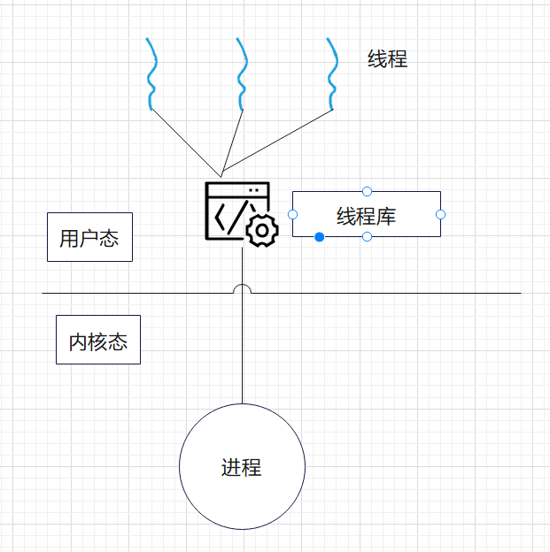
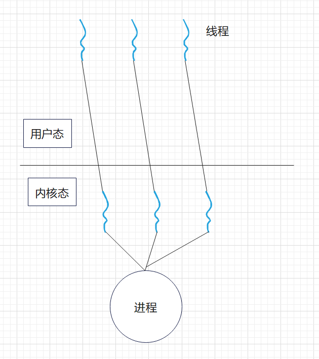
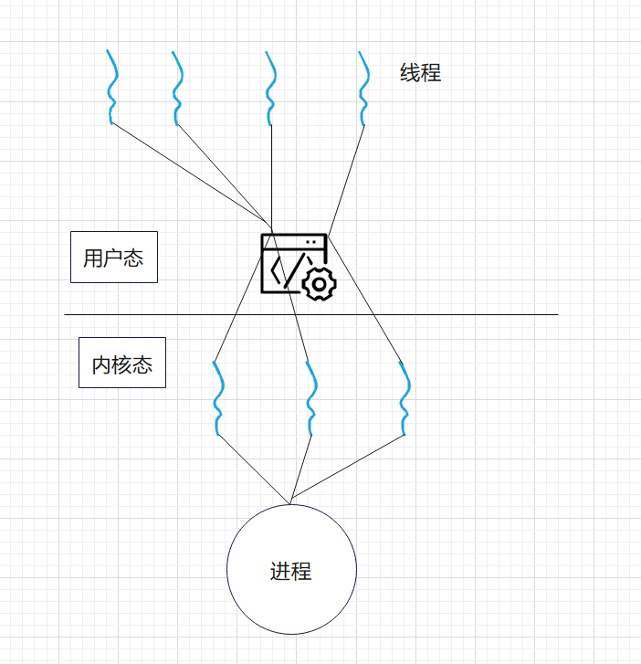

# 操作系统
## 进程和线程
我们使用进程控制块来描述进程的基本情况和允许状态
进程实体（也称为进程映像）包括：程序段，数据段，PCB

##### 进程的特性
- 动态性=》进程时程序的一次执行
- 并发性=》多个进程同存于内存
- 独立性=》进程时独立允许，独立获取资源的基本单位
- 异步性=》进程各自独立，不可预知的速度向前推进

##### 进程组成
- PCB=》进程创建的时候，操作系统为其创建一个PCB，此后该结构常驻内存，并在进程结束后删除

1. 进程描述信息：进程标识符：标识进程、用户标识符：标识所属用户
2. 进程控制和管理信息：描述进程当前状态，标识优先级
3. 资源分配清单：说明有关内存地址空间或者虚拟空间的情况
4. 处理及相关信息：也称CPU上下文，主要指的是CPU内部各个寄存器的值

note：我们通常采用链接方式或者索引方式来管理PCB
 - 链接方式：根据阻塞原因不同，排成多个阻塞队列
 - 索引方式：将同一个状态的进程组织在一个索引表中，不同表项执行对应的PCB

- 程序段：CPU执行的程序代码段
- 数据段：一个进程的数据段

##### 进程状态与切换
运行态，就绪态，阻塞态，创建态，终止态
- 这里说一下什么为创建态，这里你要清楚进程创建的步骤，在进程创建的时候，需要先申请PCB，然后向其中填写控制信息，随后分配资源，如果资源不足，就会等待资源，此时处于创建态，当得到资源的时候，初始化PCB，随后插入就绪队列

需要注意的是：进程从阻塞态变为就绪态是被动的行为，需要其它进程协助，但是就绪=》阻塞是主动的行为

##### 进程控制
一般称进程控制用的程序段为原语，原语的特点是执行期间不允许中断

- 运行一个进程创建另一个进程，此时创建者称为父进程，被创建者为子进程，子进程可以继承父进程所拥有的资源

进程终止
- 根据其标识符，检索对于PCB，然后读出该进程状态
- 如果处于运行态，立即终止该进程，然后将其CPU资源分配给其它进程
- 如果该进程还有子孙进程，一般需要将子孙进程终止
- 将该进程所拥有的全部资源归还父进程或者操作系统
- 删除其PCB

##### 进程阻塞与唤醒
- 进程使用阻塞原语（BLOCK）来使自己由运行态变为阻塞态（可见阻塞时一种主动行为）
- 当阻塞进程所期待的时间发生的时候，由有关进程调用唤醒原语（WAKEUP），将等待该事件的进程唤醒（被动行为）

##### 进程间的通信
匿名管道：最简单的IPC形式，在​​具有亲缘关系（通常是父子或兄弟）​​ 的进程间创建单工（半双工）字节流通道。数据写入管道的写入端，从读取端顺序读取（FIFO）。

命名管道：突破管道必须具有亲缘关系的限制，允许​​任何进程（甚至无亲缘关系）​​ 通过打开这个“文件”名进行通信。遵循FIFO原则。

消息队列：在内核中维护的​​消息链表​​。进程可以向队列添加​​结构化的消息​​（有类型和负载数据）或从队列中读取特定类型的消息。消息具有优先级（POSIX）或类型（SysV），使用发送消息和接收消息两个原语进行数据交换，目前的应用最广泛，微内核和服务器之间使用该通信方式。
- 直接通信方式=》直接将消息发送给对于进程，挂载到其消息队列上
- 间接通信方式：一般发送到某个中间实体，接收方从中间实体获得信息，中间实体一般称为信箱

共享内存：​​速度最快的IPC方式​​！内核将同一块物理内存映射到多个进程各自的用户空间地址范围。进程可以直接读写这块内存，就像访问自己的内存一样，​​无需内核介入拷贝​​。

信号量：它是一个用于​​同步多个进程​​（或线程）对​​共享资源​​（如共享内存区域、文件、硬件设备）访问的计数器。基本操作是PV操作（wait/P - 申请资源减小计数，signal/V - 释放资源增加计数）。

信号：用于通知进程发生了某个事件的机制，每类信号定义了一个序号，在进程的PCB 中,用至少n位向量记录该进程的待处理信号，若给某个进程发送一个信号,则把该类信号对应的位修改为1。一旦该信号被处理,就把对应的位修改为0。

socket：最强大、最通用的IPC/RPC机制​​。支持不同主机（网络IPC）或同一主机（Unix Domain Socket）上进程间通信。

##### 线程的引入
线程可以理解为更轻量级别的进程，为处理机调度的基本单位，其基本不拥有自己的资源（除了线程id,以及其自己的线程控制块（包含线程id以及寄存器，堆栈指针等等））

##### 线程和进程的区别
这个作为面试中的重要考点：请牢记
- 进程是系统中拥有资源的基本单位,而线程基本不拥有系统资源，属于同一进程的所有线程都具有相同的地址空间。
- 每个进程都不允许其余进程访问自己的独立地址空间和资源（除了全局变量），同一个进程中的线程间共享资源
- 在创建或撤销进程时,系统都要为之分配或回收进程控制块(PCB)及其他资源,如内存空间、I/O设备等，明显大于创建线程时的开销
- 进程切换需要保存进程上下文，而线程切换只需要保存和设置少量寄存器的值
- 线程支持多处理机系统，但是进程只能在单CPU上运行

##### 线程的实现方式
1. 用户级线程
线程的管理都在用户空间由用户程序进行，此时的线程对于操作系统透明

2. 内核级线程
操作系统为每个内核级线程设置一个线程控制块 TCB,内核根据该控制块感知某线程的存在,并对其加以控制。

3. 混合级线程
内核级线程对应多个用户级线程,这是用户级线程通过时分多路复用内核级线程实现的。


### 协程
##### 什么是协程
协程是一种更轻量级别的线程，可以在某个位置停止执行稍后继续执行的函数，核心是协作多任务，协程上下文切换只发生在用户级，多个协程可以运行在同一个线程
##### 线程和协程的区别
- 协程为协作式，只能主动释放CPU，而线程为抢占式
- 线程占用的内存资源大于协程，切换消耗大于协程
- 同一个线程中建立的多个协程无需锁  
- 协程只能运行在用户态，但线程可以运行在用户态和内核态

### 处理机调度
为什么要调度：因为进程数量要远多于CPU数量，所以争用CPU在所难免

---

##### 调度分类

调度分为以下几种
1. 高级调度（作业调度）：按照某种规则从外存上处于后备队列的作业中挑选一个，给它分配内存，IO等必要的资源，作业调度就是内存与辅存的调度
2. 中级调度：决定将外存上的那些已具备运行条件的挂起进程再重新调入内存,并修改其状态为就绪
态,挂在就绪队列上等待。中级调度实际上是存储器管理中的对换功能。
3. 低级调度：按照某种算法从就绪队列中选取一个进程,将CPU 分配给它。

##### 调度的实现
用于调度和分派CPU的组件，被称为调度程序
由三部分组成
1. 排队器：系统中所有就绪进程按照一定策略排成多个队列，以便于调度程序选择。
2. 分派器：依据调度程序所选的进程，将其就绪队列中取出，将cpu分配新进程
3. 上下文切换器：在对CPU进行切换的时候，会发生两对上下文的切换，第一对是将当前进程上下文保存到PCB中，在装入分派程序的上下文，以便于程序运行，第二对移出分派程序上下文，将新选进程的CPU现场信息分别装入CPU的各个寄存器

##### 闲逛进程
当进程切换的时候，如果系统中没有就绪进程，就会调用闲逛进程，其PID为0，其优先级最低


##### 调度算法的评价标准
1. CPU利用率
CPU利用率 = CPU有效工作时间/（CPU有效工作时间+总时间）
2. 系统吞吐量
单位时间CPU完成作业的数量
3. 周转时间
等于作业完成时间 - 作业提交时间
4. 带权周转时间
等于作业周转时间/作业实际运行时间
5. 等待时间
进程处于等待CPU的时间之和
6. 响应时间
用户提交请求到系统首次响应所使用的时间

##### CPU调度算法
1. FCFS 先来先服务 FCFS 调度算法每次从就绪队列中选择最先进入该队列的进程,将CPU 分配
给它,使之投入运行,直到运行完成或因某种原因此阻塞时才释放 CPU。
2. SJF 短作业优先算法 指对短作业有优先调度的算法
3. 高响应比优先：响应比 = （等待时间+实际运行时间）/ 实际运行时间
4. 优先级调度算法：一般来说：系统进程>用户进程 ， 交互 > 非交互 ， IO > 计算
5. 时间片轮转调度算法：主要用于分时系统，最大的特点为公平
6. 多级反馈队列调度算法（这个较为复杂，融合了前几种算法的优点）
实现思想如下
1. 设置多个就绪队列，不同队列不同优先级
2. 赋予各个队列进程的时间片大小各不相同，优先级越高，时间片就越小
3. 每级队列都采用FCFS算法
4. 按队列优先级调度：仅当第一级队列为空的时候，才会调度第二级队列的进程运行。如果又有新进程记入任何一个优先级较高的队列，那么就会发生抢占式调度

##### 多处理机调度
一般为主机进行进程调度，从机空闲的时候，从机就向主机索取一个进程

处理器亲和性：让一个进程运行在同一个CPU上
负载均衡应该设法将负载均匀分派到所有CPU中

多处理机调度方法
1. 公共就绪队列：系统中仅仅设置一个公共就绪队列，所有CPU共享
2. 私有就绪队列：每个CPU有一个私有就绪队列，然后由特定的负载均衡进程来进行负载均衡
包含推迁移和拉迁移 ：负载过高，就要推出，负载过低，就要拉入

这里介绍一个我们最常使用的负载均衡组件：nginx
其负载均衡的方法为（随机，带权分派，一致性哈希，选取负载最低的服务器）

### 同步和互斥
一般来说，对于临界资源的访问分为四部分
while(true){
  进入区
  临界区
  退出区
  剩余区
}
1. 进入区
在进入区要检查可否进入临界区,若能进入临界区,则应设置正在访问临界区的标志,以阻止其他进程同时进入临界区。
2. 临界区
访问临界资源的代码
3. 退出区
清除正在访问的标志
4. 剩余区
代码的其它部分

同步称为相互制约关系：规定了进程执行的顺序
互斥称为间接制约关系：对于临界资源的互斥访问
互斥需要遵循四个原则
1. 忙则等待
2. 空闲让进
3. 有限等待
4. 让权等待

#### 常用的临界区互斥方法

1. 软件实现方法

单标志法
```
进程 Po: 
while (turn!=0);
critical section;
turn = 1;
remainder section;

进程P1:
while(turn!=1);
critical section;
turn = 0;
remainder section;
```
所谓的单标志法，其实就是进入之前检查一下罢了

```
双标志先检查法
每次进入之前检查一下对面
进程1
while (flag [1]);
flag[0]=true;
critical section;
flag[0]=false;
remainder section;

进程2
while(flag[0]);
flag[1]=false;
critical section;
flag[1]=true;
remainder section
```

```
双标志后检查法
进入之后再进行检查
flag[0]=true;
while(flag[1]);
critical section;
flag[0]=false;
remainder section;

进程2略
```

```
Peterson 算法
相较于其余算法，其关键思想就是让步
进程 Po:
flag[0]=true;//表示自己想要进入
turn=1;//将进入权限让给对方，询问对方是否想要进入
while(flag [1] &&turn==1);//如果对方想要进入且把权限让给了对方，否则就进入
critical section;
flag[0]=false;//结束，让出临界区
remainder section;
P1略
```

##### 互斥锁
实际上，解决临界区最简单的方法就是使用互斥锁，当进入临界区之前获取锁，离开临界区时释放锁

##### 信号量
信号量机制是一种功能较强的机制，可以解决互斥和同步问题，只能被两个标准的原语进行访问，也就是我们常说的PV操作

##### 经典同步问题

生产者-消费者问题
系统中有一组生产者进程和一组消费者进程,生产者每次生产一个产品并放入缓冲区,消费者每次从缓冲区中取出一个产品并消费。生产者和消费者共享一个初始为空、大小为n的缓冲区。只有当缓冲区不满时,生产者才能将产品放入缓冲区;否则必须等待。只有当缓冲区不空时,消费者才能从中取出产品:否则必须等待。缓冲区是临界资源,各进程必须互斥访问。 

1) 关系分析。生产者和消费者对缓冲区的访问是互斥关系,同时生产者和消费者又是一个相互协作的关系,只有生产者生产之后,消费者才能消费,它们也是同步关系。
2) 整理思路。这里比较简单,只有生产者和消费者两个进程,正好是这两个进程存在着互斥关系和同步关系。那么需要解决的是互斥和同步 PV 操作的位置。
3) 信号量设置。信号量 mutex 作为互斥信号量,用于控制互斥访问缓冲池,互斥信号量初值为1;信号量 full 用于记录当前缓冲池中的“满”缓冲区数,初值为0。信号量 empty用于记录当前缓冲池中的“空”缓冲区数,初值为n。

读者-写者问题
有读者和写者两组并发进程,共享一个文件,当两个或以上的读进程同时访问共享数据时不会产生副作用,但若某个写进程和其他进程(读进程或写进程)同时访问共享数据时则可能导致数据不一致的错误。因此要求:
①允许多个读者可以同时对文件执行读操作;
②只允许一个写者往文件中写信息;
③任意一个写者在完成写操作之前不允许其他读者或写者工作;
④写者执行写操作前,应让已有的读者和写者全部退出。

哲学家进餐问题
一张圆桌边上坐着5名哲学家,每两名哲学家之间的桌上摆一根筷子,两根筷子中间是一碗米饭
只有当哲学家饥饿时,才试图拿起左、右两根筷子(一根一根地拿起)。若筷子已在他人手上,则需要等待。饥饿的哲学家只有同时拿到了两根筷子才可以开始进餐,进餐完毕后,放下筷子继续思考。

##### 管程

利用共享数据结果抽象的表示系统中的共享资源，而将对该数据结构实施的操作定义为一组过程，进程对于共享资源的申请，释放等操作，都通过这组进程来实现，这组过程还可以根据资源的情况，或接受或者阻塞进程的访问，确保每次仅有一个进程使用共享资源，这样就可以同一管理对共享资源的所有访问

管程由四部分组成
①管程的名称
②属部于管程内部的共享数据结构说明:
③对该数据结构进行操作的一组过程(或函数);
④对局部于管程内部的共享数据设置初始值的语句。

##### 条件变量
我们将阻塞的原因定义为条件变量
每个条件变量保存了一个等待队列，用于记录因为该条件变量而阻塞的所有进程
对条件变量只能进行两种操作，也就是wait，signal

下面是一个用C++实现的生产者和消费者
```C++
#include <iostream>
#include <thread>
#include <mutex>
#include <condition_variable>
#include <queue>

std::mutex mtx;
std::condition_variable cv;
std::queue<int> data_queue;

void producer() {
    for (int i = 0; i < 5; ++i) {
        {
            std::lock_guard<std::mutex> lock(mtx);
            data_queue.push(i);
            std::cout << "Produced " << i << std::endl;
        }
        cv.notify_one(); // 通知等待的消费者
        std::this_thread::sleep_for(std::chrono::milliseconds(100)); // 模拟工作
    }
}

void consumer() {
    while (true) {
        std::unique_lock<std::mutex> lock(mtx); // unique_lock 用于 wait
        cv.wait(lock, [] { return !data_queue.empty(); }); // 等待条件成立 (队列不为空)
        int data = data_queue.front();
        data_queue.pop();
        std::cout << "Consumed " << data << std::endl;
        lock.unlock(); // 可以提前解锁 (unique_lock 支持)
        // ... 处理数据
    }
}

int main() {
    std::thread prod_thread(producer);
    std::thread cons_thread(consumer);
    prod_thread.join();
    cons_thread.join(); // 注意：此循环无限，实际中需要退出机制
    return 0;
}
```

### 死锁

##### 基本概念

死锁：指的是多个进程因为竞争资源而造成的一种僵局，使得各个进程都被阻塞，若无外力干涉，这些进程都无法向前推进

##### 死锁产生的原因

1. 系统资源的竞争
2. 进程推进顺序非法

##### 死锁产生的必要条件

1. 互斥：资源进行排他性使用
2. 不可剥夺：进程所获得资源只能由自己主动释放
3. 请求和保持：进程持有资源的情况下还去请求其他资源
4. 循环等待：存在一种进程资源的循环等待链

##### 死锁的处理策略

1. 死锁预防
破坏互斥条件：将只能互斥使用的资源改造为允许共享使用
破坏不可剥夺条件：当一个已经持有某些不可剥夺资源的进程请求新的资源无法满足的时候，必须释放保持的资源
破坏请求并保持条件：预先分配全部资源或者进程在运行期间逐步释放已经分配给自己的资源
破坏循环等待条件：采用顺序资源分配法，给系统中各类资源编号，每隔进程必须按照编号递增的顺序请求资源，只有持有小编号的资源，才有资格申请更大编号的资源
2. 死锁避免
我们将系统能够按照某种进程推进顺序为每个进程分配所需的资源，直到满足每隔进程对资源的最大需求，使得每个进程都可以顺利完成，此时成系统处于安全状态

银行家算法
假设系统中有n个进程,m类资源,在银行家算法中需要定义下面4个数据结构。
可利用资源向量Available：当前每类资源的数量
最大需求矩阵Max：每个进程对于各类资源的最大需求
分配矩阵Allocation：已经分配给各个进程的资源数
需求矩阵Need：每个进程接下来还需要多少资源

note：
Need = Max - Allocation

算法描述


3. 死锁的检测与解除


