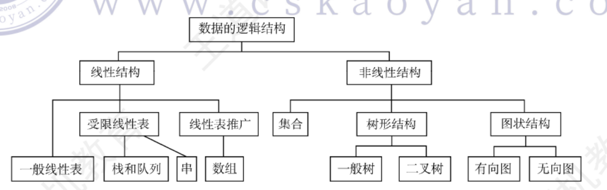
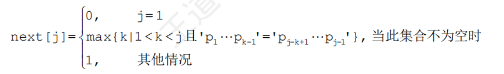

# 数据结构
## 绪论
抽象数据类型描述了数据的逻辑结构和抽象运算=》用（数据对象，数据关系，基本操作集）这样的三元组来表示
逻辑结构是数据元素之间的逻辑关系，与数据的存储无关，分为线性结构和非线性结构
逻辑结构可以独立于存储结构，但是存储结构是逻辑结构的映射

数据的存储结构包括 链式存储，顺序存储，索引存储，散列存储

### 算法的基本概念
算法一般具有五个重要特征=》有穷性，确定性，可行性，输入，输出
好的算法应该有以下四个指标=》健壮性，正确性，可读性，高效率和低存储需求

---
我们通常使用时间复杂度和空间复杂度来衡量一个算法的性能
时间复杂度是指基本运算的频度：是执行时间的度量
空间复杂度指的是辅助空间的大小（处理程序和输入外的额外空间）

## 线性表

## 栈，队列和数组
### 栈
栈是一种先进后出的数据结构
卡特兰数公式：当个不同元素入栈时,出栈元素不同排列的个数为
$$
\frac{1}{n+1} C_{2n}^{n}
$$
栈的基本操作包含入栈，出栈，判断栈是否为空等等

#### 共享栈
使两个栈共享一个一维数组空间，栈底分别设置为栈的两端，向中间延伸

#### 链栈
我们使用单链表来表示栈，这使得栈没有大小限制，同时规定入栈和出栈均在链表的头结点

### 队列
队列是一种先进先出的数据结构
为了避免假溢出情况，我们通常将队列臆造为环形结构
此时为了区分队满和队空，一般存在如下三种方法
1. 牺牲一个存储单元来区分队空和队满，约定以队尾指针指向队首指针下一个位置来表示队慢
队满条件: (Q.rear+1) %MaxSize  == Q.front。
队空条件: Q.front==Q.rear。

2. 类型中添加size成员变量，用来标识当前队列中成员个数

3. 增加tag成员变量来标识最后一次的操作，如果最后一次操作时插入tag = 1，如果时删除tag = 0。

##### 链式队列
链式队列包含两个指针，分别指向队头结点和队尾结点

##### 双端队列
指的时可以在队头和队尾进行插入和删除的队列，就是C++STL中的deque

### 栈和队列的应用
##### 栈
- 括号匹配
- 算数表达式求值
- 递归

中缀表达式转后缀表达式
1) 遇到操作数。直接加入后缀表达式。
2) 遇到界限符。若为“(”,则直接入栈;若为“)”,则不入栈,且依次弹出栈中的运算
符并加入后缀表达式,直到遇到“(”为止,并直接删除“(”。
3) 遇到运算符。①若其优先级高于栈顶运算符或遇到栈顶为“(”,则直接入栈;②若其优先级低于或等于栈顶运算符,则依次弹出栈中的运算符并加入后缀表达式,直到遇到一个优先级低于它的运算符或遇到“(”或栈空为止,之后将当前运算符入栈。
按上述方法扫描所有字符后,将栈中剩余运算符依次弹出,并加入后缀表达式。

后缀表达式求值
从左往右依次扫描表达式的每一项,若该项是操作数,则将其压入栈中;若该项是操作符<op>,则从栈中退出两个操作数和x,形成运算指令X<op>Y,并将计算结果压入栈中。当所有项都扫描并处理完后,栈顶存放的就是最后的计算结果。

##### 队列
- 层次遍历
- 操作系统中的就绪队列，阻塞队列等等

### 矩阵
矩阵其实就是对顺序表的扩展，增加了其维数
这里介绍几种特殊的矩阵的压缩存储方法
1. 对称矩阵：存储上三角或者下三角
2. 三角矩阵: 只按行或者按列用一维数组存储
3. 稀疏矩阵；三维存储，直接存储矩阵中的元素数量和每个元素行 列 值。

## 串
这里最重要的就是模式匹配了，KMP算法和优化的KMP算法时重中之重
##### 基础概念
前缀：除了最后一个字符外，字符串所有的头部子串
后缀：除了第一个字符外，字符串的所谓尾部
部分匹配值：字符串前缀和后缀最长相等前后缀长度
next数组：当模式串的第j个指针失配的时候，跳到next[j]的位置继续

##### KMP算法
暴力求解中每次匹配失败就要从头开始匹配
而我们如果从分析模式串本身的结构入手
若已经匹配相等的前缀序列中某个后缀正好是模式串的前缀，那么就可将模式串向右移动到与这些相等对齐的位置，这就是计算next数组的依据，使用了KMP算法，主串就无需回溯

---
next数组手算方法
在不匹配的位置前画一条分界线,模式串一步一步往后退,直到分界线之前能对上(首尾重合),或模式串完全跨过分界线为止。

---
求next数组公式

```C++
next数组的代码求法
void get_next(SString T, int next []) {
  int i=1,j=0;
  next [1]=0;
  while(i<T.length) {
    if (j==0||T.ch[i]==T.ch[j]) {
        ++i; ++j;
        next [i]=j; //若p=p,则 next[j+1]=next [j] +1
        }
    else
      j=next [j]; //否则令j=next[j],循环继续
  }
}
```


## 树
#### 基本概念
生成树 =》 就是极小联通子图 =》无环且联通
联通分量 =》 极大联通子图：一个图如果是联通的，那么只存在一个联通分量，如果不连通，存在多个
极小联通子图 =》最小网络

#### 折半查找判定树
折半查找是针对顺序存储的有序序列，因此折半查找排序树必是一颗二叉排序树
- 中序遍历可以得到一个有序序列
- mid向上取整 =》右子树结点数 = 左子树结点数 || 左-1 = 右
- mid向下取整 =》左子树结点数 = 右子树结点数 || 右-1 = 左


#### 哈夫曼树
最优二叉树=》树的带权路径长度达到最小，用于构造哈夫曼编码
note：请按照左小右大，左0右1的顺序构造

### 排序
基数排序
基数排序的思想是按照基数位进行多趟的入队出队操作

稳定的四种排序算法 =》基，冒，插，归

不稳定的四种排序算法 =》选，堆，希，快
