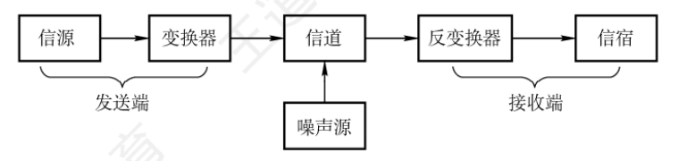
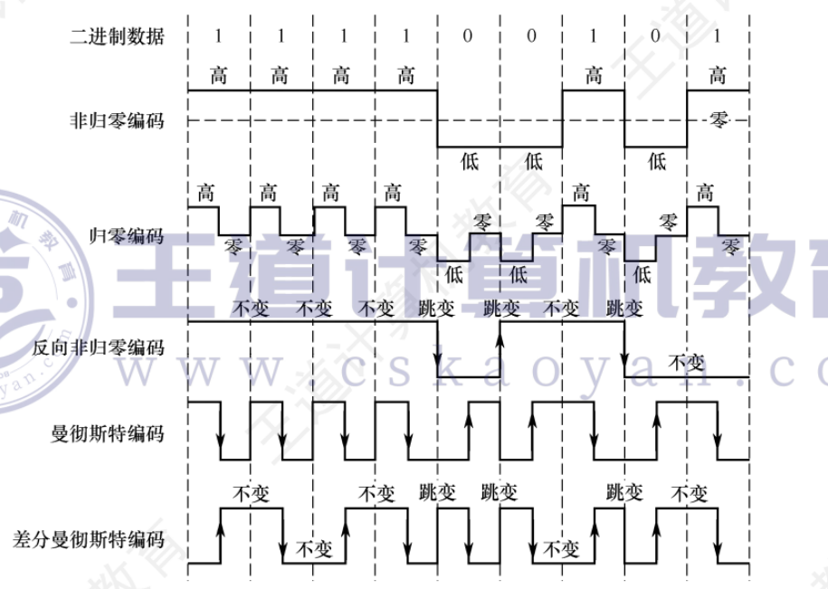
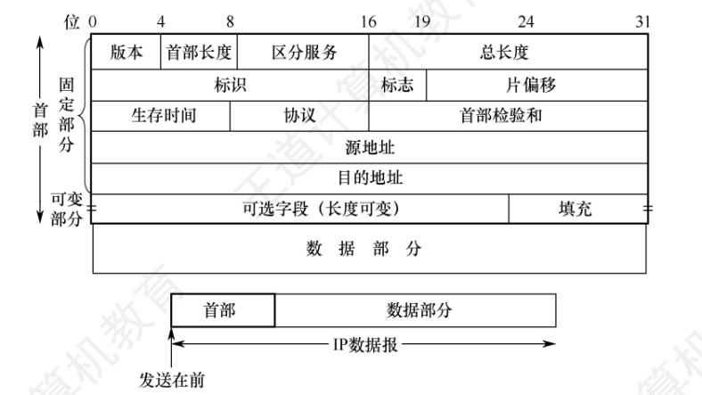
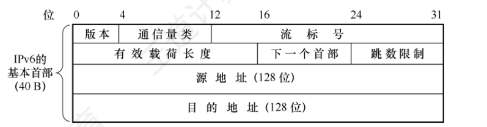
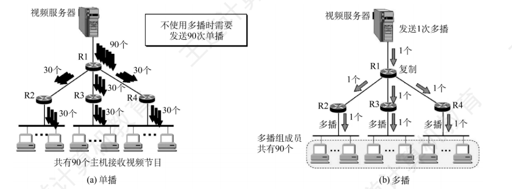
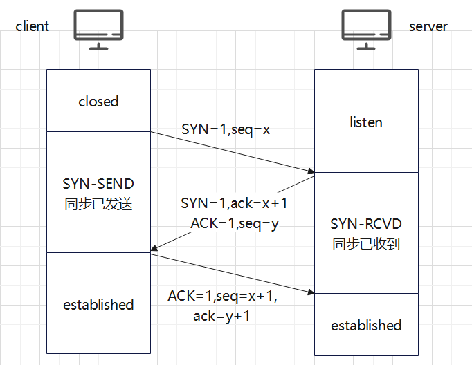
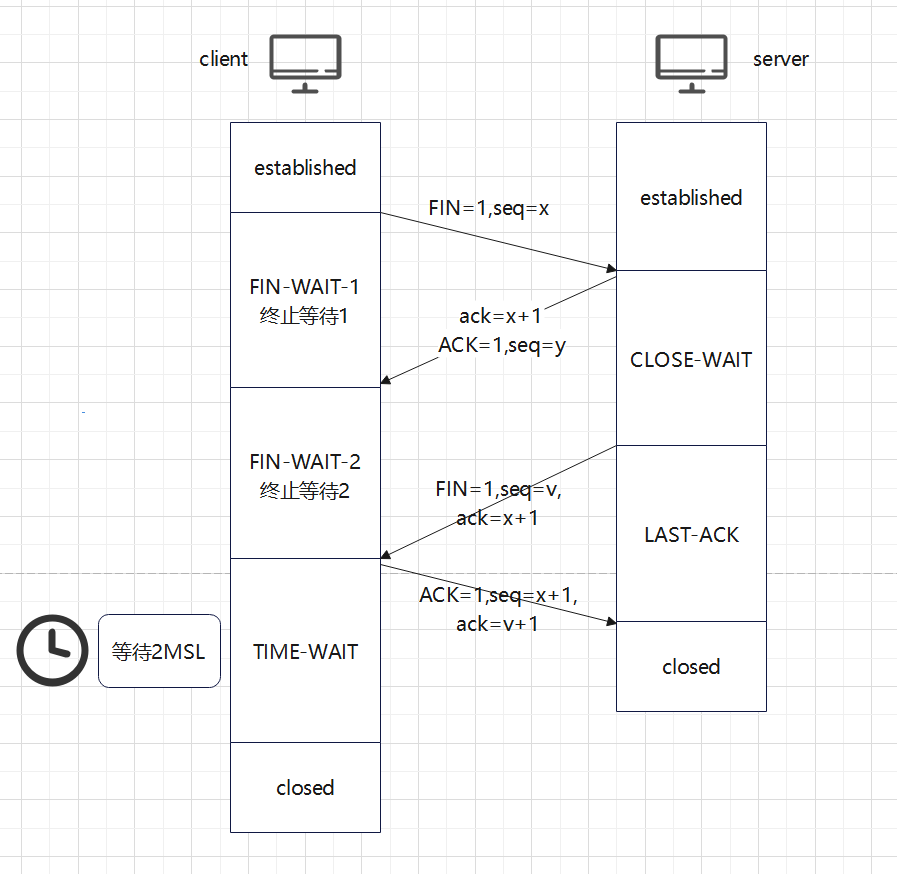
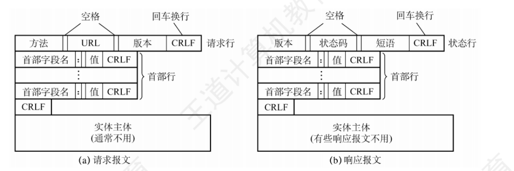

# 计算机网络详解
writer：wjm

由于现有的教学大纲都是按照物理层，链路层，网络层，传输层，应用层来教学
我们也是按照这种教学方法来介绍
## 物理层
### 基本概念
数据是指信息传送的实体
信号则是数据的电气或电磁表现，是数据在传输过程中的存在形式
数据和信号都存在模拟或数字之分
1. 模拟数据的取值是连续的
2. 数字数据的取值是离散的

在通信系统中，常使用一个固定时长的信号波形来表示一个K进制数，这个时长内的信号称为码元，而该时长称为码元宽度

#### 信源、信道、信宿
下图是一个单项通信系统的模型

信源是产生和发送数据的源头，信宿是接收数据的终点，信道是信号的传输介质
note：一条双向通信的线路包含一个发送信号和一个接收信道
噪声源是信道上的噪声及分散在通信系统上其他各处的噪声的集中表示

基带传输：信道上直接未经过调制的原始电信号
宽带传输：信道上传输经过调制的信号

数据传输方式分为并行和串行
- 并行传输适合短距离传输，一般用于计算机内部
- 串行传输适合长距离传输

#### 奈奎斯特定理
在理想低通信道（无噪声，带宽有限），为了避免码间串扰，极限码元传输速率未2W波特
W为信号的频率带宽（HZ为单位），如果用V来表示每个码元的离散电平数量
那么有
$$
\text{理想低通信道的极限数据传输速率} = 2W\log _{2}V \; (\mathrm{b/s})
$$
上述公式其实就是将以码元为单位转为以b/s为单位

#### 香农定理

给出带宽受限且具有高斯噪声干扰的信道的极限数据传输速率
**信道的极限数据传输速率** $= W \log_{2} (1 + S/N) $

W表示信号的频率带宽
S/N为信噪比

#### 编码和调制

将数据转换为数字信号称为编码，将数据转换为模拟信号称为调制

#### 常用的数字数据编码

##### 归零编码

高电平表示1，低电平表示0，每个码元之间均跳变到零电平

##### 非归零编码

与归零编码不同的是不需要归0，但是存在同步问题，需要双方都带有时钟线

##### 反向非归零编码

与NRZ编码的区别是用电平的跳变表示0，电平不变表示1

##### 曼彻斯特编码

每个码元中间都进行跳变，向下跳变表示1，向上表示0

##### 差分曼彻斯特编码

每个码元中间都进行跳变，用来表示时钟信号，数据的表示在于每个码元开始处是否有电平跳变，无跳变表示1，有跳变表示0

标准以太网使用的就是曼彻斯特编码,而差分曼彻斯特编码则被广泛用于宽带高速网中。

#### 数字数据调制成模拟信号

数字调制分为三种方式：调幅，调频，调相
调频通过改变载波的频率来表示数字信号1和0.抗干扰能力较强

### 传输介质

#### 双绞线，同轴电缆，光纤与无线传输介质

##### 双绞线

双绞线由两根采用一定规则并排绞合、相互绝缘的铜导线组成。绞合可减少对相邻导线的电磁干扰。还可在双绞线的外面加上一层金属丝编织成的屏蔽层,这就是屏蔽双绞线(STP)。

##### 同轴电缆

同轴电缆由内导体、绝缘层、外导体屏蔽层和绝缘保护套层构成。

##### 光纤

光纤通信是指利用光导纤维(简称光纤)传递光脉冲来进行通信。有光脉冲表示1，无光脉冲表示0
利用光的全反射特性，可以让不同角度入射的多条光线在一根光纤中传输，这种光纤被称为多模光纤
当光纤的直径减小到只有一个光的波长的时候，光一直向前传播，这样的光纤称为单模光纤

##### 无线传输介质

无线电波：穿透能力强，传输距离长，广泛用于通信领域

微波，红外线和激光

##### 物理层接口的特性

机械特性：指明接口所用接线器的形状和尺寸，引脚数量和排列，固定和锁定装置
电气特性：指明在接口电缆的各条线上的电压范围，传输速率，距离限制
功能特性：指明某条线上出现的某一电平的电压的意义
过程特性：指明不同功能的各种可能时间的出现顺序

#### 物理层设备

中继器：放大，整形并转发信号，原理是信号再生，中继器两端的网络是网段，被中继器连接的几个网段仍是一个局域网，遵循5-4-3原则（用4个中继器串联的5段通信介质中,只有3段可以挂接计算机）

集线器：实质上是一个多端口的中继器。当一个端口收到数据信号的时候，进行整形放大，紧接着转发到其他所有端口

## 数据链路层

该层实现的为点对点的通信

### 数据链路层的功能

#### 链路管理

链路层连接的建立，维持和释放过程称为链路管理，主要用于面向连接的服务

#### 封装成帧和透明传输

##### 封装成帧

在一段数据的前后分别加上首部和尾部，形成帧
首部和尾部包含很多控制信息，可以实现帧定界等功能

##### 透明传输

透明传输是指不论什么样的比特组合的数据,都能够按照原样无差错地在这个数据链路上传输。

#### 流量控制

流量控制实际上就是限制发送方的发送速率,使之不超过接收方的接收能力。

#### 差错检验

分为帧错和位错
位错：帧中的某些位发生差错，使用CRC冗余校验
帧错：帧丢失，帧重复或者帧失序

### 组帧

发送方根据一定的规则将网络层递交的分组封装为帧

#### 字符计数法

使用一个计数字段来记录该帧含有的字节数

#### 字节填充法

使用EOT和SOH来标识帧的结尾和开头，在数据部分使用转义字符ESC来加以区分

#### 零比特填充法

使用01111110来标志一个帧的开始和结束，在数据部分，每逢5个1，插入一个0

#### 违规编码法

借助违规序列来界定帧的开始和结束

### 差错控制

#### 检错编码

##### 奇偶校验码

附加一个校验位后，使得整个校验码中的1的个数为奇数或者偶数

##### 循环冗余校验码

收发双方约定一个生成多项式，发送方基于该多项式计算出冗余码，然后随数据一起发送，接收方接收到后，根据冗余码计算是否产生差错，余数为0，代表无差错

#### 纠错编码

最常见的纠错编码就是海明码

在有效信息位中加入几个校验位形成海明码

码距是指两个码字对应位取值不同的比特数量，计算码距的方法位对两个位串进行异或，结果中一的个数位码距，在编码集中，码距的最小值为编码集的码距

l = d+c+1，其中l为码距。d为检错位数，c为纠错位数

##### 海明码的编码过程

1. 确定海明码的位数
2的k次幂 >= n+k+1
信息位为n，校验位为k

2. 确定校验位的分布，规定校验位i在海明位号为2的（i-1）次幂的位置上

3. 分组以形成校验关系

被检验数据位的海明位号等于检验该数据位的各检验位海明位号之和。

4. 校验位取值

检验位i的值为第i组所有位区异或

5. 校验原理

每个检验组分别利用检验位和参与形成该检验位的信息位进行奇偶检验检查,构成k个检验方程:
对应的数为错误位位号，全0代表无错

### 流量控制和可靠传输机制

#### 流量控制和滑动窗口机制

##### 滑动窗口

发送窗口表示在还未收到对方确认信息的情况下,发送方最多还能发送多少个帧和哪些帧。
同理,在接收方设置接收窗口是为了控制可以接收哪些帧和不可以接收哪些帧。

发送方每收到一个按序确认的确认帧,就将发送窗口向前滑动一个位置。这样,就有一个新的序号落入发送窗口,序号落入发送窗口内的数据帧可以继续发送。当窗口内没有可以发送的帧(窗口内的帧全部是已发送但未收到确认的 )时,发送方就停止发送。
接收方每收到一个序号落入接收窗口的数据帧,就允许将该帧收下,然后将接收窗口向前滑动一个位置,并发回确认。这样,就有一个新的序号落入接收窗口，序号落入接收窗口的数据帧即为准备接收的数据帧

##### 停止等待协议

发送方每次只允许发送一个帧,接收方每接收一个帧都要反馈一个确认信号,表示可以接收下一帧,发送方收到确认信号后才能发送下一帧。

##### 后退N帧协议

在后退N帧协议中,发送方可在未收到确认帧的情况下,将序号在发送窗口内的多个数据帧全部发送出去。后退 N帧的含义是:发送方发送N个数据帧后,若发现这 N 个帧的前一个数据帧在计时器超时的时候仍未收到其确认信息,则该帧被判为出错或丢失,此时发送方不得不重传该出错帧以及随后的N个帧

同时采用了累积确认

##### 选择重传协议

为了使发送方仅重传出错的帧,接收方不能再采用累积确认,而要对每个正确接收的数据帧逐一进行确认。

上述均遵循 WR+WT <= 2的n次幂
即发送窗口+接收窗口小于等于2的序号位数次幂

### 介质访问控制

#### 信道划分介质访问控制

指的是将使用同一传输介质的多个设备通信隔离开来，通过分时，分频，分码等方法进行划分

##### 时分复用

将信道传输时间划分为一段段等长的时间片，称为TDM帧，每个用户占用固定序号的时隙

##### 频分复用

将信道的总频带划分为多个子频带，每对用户使用一个子信道进行通信

##### 波分复用

即光的频分复用

##### 码分复用

采用不同的编码来区分各路原始信号

#### 随机访问介质访问控制

##### ALOHA协议

ALOHA 协议分为纯ALOHA 协议和时隙ALOHA 协议两种。

1. 纯ALOHA协议
当总线形网络中的任何站点需要发送数据时,可以不进行任何检测就发送数据。若在一段时间内未收到确认,则该站点就认为传输过程中发生了冲突。发送站点需要等待一段随机的时间后再发送数据,直至发送成功。

2. 时隙ALOHA协议
时隙 ALOHA 协议同步各站点的时间,将时间划分为一段段等长的时隙(Slot),规定站点只能在每个时隙开始时才能发送帧,发送一帧的时间必须小于或等于时隙的长度。

##### CSMA协议

1. 1-坚持CSMA
当站点要发送数据时,首先监听信道;若信道空闲,则立即发送数据;若信道忙,则继续监听直至信道空闲。

2. 非坚持CSMA
当站点要发送数据时,首先监听信道;若信道空闲,则立即发送数据;若信道忙,则放弃监听,等待一个随机的时间后,再重新监听。

3. p-坚持CSMA
当站点要发送数据时,首先监听信道;若信道忙,则持续监听(等到下一个时隙再监听),直至信道空闲;若信道空闲,则以概率p 发送数据,以概率1-p推迟到下一个时隙再继续监听;直到数据发送成功。

##### CSMA/CD协议

先听后发,边听边发,冲突停发,随机重发

也就是每个站点在发送前需要检测信道，在发送过程中也要检测信道，如果发生冲突，就停止发送数据，等待一段时间再次发送

一个站点发送数据后最多要经过2*（端到端时延）就可以知道有没有发生冲突，这个时延称为争用期

故最短帧长计算公式为 = 最大单向传播时延 * 数据传输速率 * 2

如以太网最短帧长为64B

采用二进制指数退避算法来确定重发后重传的时机

1. 确定基本退避时间：一般取争用期

2. 从离散的整数集合中随机取出一个数[0 . 1 . 2 . 2的k次幂-1]，记作r，重传所需推迟时间就是r * 争用期
k为min(重传次数，10)

3. 如果重传16次仍然没有成功，说明网络太拥挤，认为该帧无法正确发出

##### CSMA/CA协议

使用于无线通信
将冲突检测改为冲突避免
由于无线信道的通信指令远不如有线信道，所以802.11使用了链路层确认/重传机制
即站点每通过无线局域网发送完一帧,就要在收到对方的确认帧后才能继续发送下一帧。

为了尽力避免冲突，802.11规定检测到信道空闲的时候，还要再等待一段时间才能发送帧

帧间间隔三种IFS：

1. SIFS：最短的IFS，用来分隔属于一次对话的各帧

2. PIFS: 中等长度的IFS，再AP集中控制的链路传输中使用

3. DIFS：最长的IFS，不采用任何中心控制的链路传输中使用

指数退避算法的范围不一致，为2的（2+k）次幂-1，且到255的时候就不再增加

### 局域网

以太网中帧的格式

目的地址 6B
源地址 6B
类型 2B ：指出数据字段中的数据应交给哪个上层协议处理,如网络层的IP.
数据 46 ~ 1500B
FCS 4B ：检验范围从目的地址段到数据字段

在使用了VLAN的帧中
目的地址 6B
源地址 6B
VLAN标签 4B
类型 2B ：指出数据字段中的数据应交给哪个上层协议处理,如网络层的IP.
数据 42 ~ 1500B
FCS 4B ：检验范围从目的地址段到数据字段

## 网络层

### 网络层的功能

网络层实现的是主机到主机之间的通信

#### 异构网络互联

网络互联是指将两个以上的计算机网络通过一定方法连接起来

#### 路由与转发

路由器的两个主要功能，路由选择，分组转发
前者根据路由选择协议构造并维护路由表
后者处理通过路由器的数据流

#### 网络层提供的两种服务

1. 虚电路
先建立网络层的连接，也就是一条逻辑上的虚电路，整个通信过程分为三个阶段：虚电路建立，数据传输，虚电路释放

在每个节点都维持一张虚电路表，表中每项记录一个打开的虚电路的信息

2. 数据报

源主机的高层协议将报文拆成若干较小的数据段，并加上地址等控制信息后组成分组，中间节点存储分组很短的一段时间，找到最佳路由后，尽快进行转发

#### SDN基本概念

软件定义网络：采用集中式的控制平面和分布式的数据平面，两个平面相互分离
控制平面利用控制-数据接口对数据平面的路由器进行集中控制，路由器之间不再需要互相交换路由信息，而是由远程控制器掌握各个主机和整个网络之间的状态，然后通过openflow协议将转发表下发给路由器

在一些大型的数据中心之间的互联网，使用SDN来建造，就可以使网络的允许效率更高

SDN提供编程的接口称为北向接口，北向接口提供了一系列丰富的API，开发者以在此基础上设计自己的应用，SDN控制器和转发设备建立双向会话的接口称为南向接口

### IPV4

IPV4即现在普遍使用的网际i协议，IP定义数据传送的基本单元--IP分组及其确切的数据格式

IPV4分组的格式

版本：指IP的版本
首部长度：以4B为单位，意味着首部长度为20B~60B
总长度：以1B为单位，以太网最大传输单元为1500B，数据报最大长度为65535B，如果超过以太网最大长度，就需要进行分片
标识：计数器，每次产生一个数据报就+1，用来在分片中标识每一个数据报
标志：MF=1表示后面还有分片，DF=0时才允许分片
片偏移：指出较长的数据片在分片后，某片在原数据报的相对位置
生存时间：标识数据报在网络中可通过的路由器数的最大值
协议：指出此数据包携带的数据使用何种协议
首部校验和：只检验数据报的首部
源地址字段：发送方的IP地址
目的地址字段：接收方的IP地址

#### IPV4地址与NAT

IP地址是给连接到互联网上面的每台主机的每个接口分配一个全球范围的唯一标识符
A类：1~126
B类：128~191
C类：192~223
D类：224~239
E类：240~255

note：主机号全零标识本身，全1表示广播地址

127.x.x.x作为本地软件环回测试

因为广泛使用无分类 IP地址进行路由选择,这种传统分类的IP地址已成为历史。

NAT（网络地址转换）
将专用网络地址转换为公用地址
专用网络地址包括

1. 10.0.0.0~10.255.255.255
2. 172.16.0.0~172.31.255.255
3. 192.168.0.0~192.168.255.255

NAT的工作原理

通过NAT转换表进行转换

#### 子网划分

除了网络号，还将网络号划分为子网号，使得网络的分配更加灵活

##### 无分类编址CIDR

消除了传统的ABC类的概念，使用斜线计法来标识网络号
如：192.168.152.1/21

##### 路由聚合

在路由表中利用一个较大的CIDR地址块代替许多小的地址块

#### 地址解析协议

路由器由于互联多个网络，所以其不仅具有多个IP地址，还具有多个MAC地址

由于最终传输数据帧的时候，最终必须使用硬件地址，所以需要一种方法完成IP地址到MAC地址的映射，也就是地址解析协议ARP

每台主机均存在一ARP告诉缓存，用来存放本局域网中的各个主机和路由器IP地址到MAC地址的映射表，简称为ARP表

ARP 对高速缓存中的每个映射表项都设置了生存时间

##### ARP协议

主机A欲向本局域网上的某台主机 B 发送 IP 数据报时,先在其 ARP 高速缓存中查看有无主机B 的IP地址。若有,则可以查出其对应的硬件地址,再将此硬件地址写入 MAC 帧,然后通过局域网将该 MAC 帧发往此硬件地址。若没有,则通过使用目的 MAC 地址为FF-FF-FF-FF-FF-FF的帧来封装并广播ARP 请求分组(广播发送),使同一个局域网里的所有主机都收到此ARP 请求。主机B收到该ARP 请求后,向主机 A 发出 ARP响应分组(单播发送),分组中包含主机B的IP地址与 MAC 地址的映射关系,主机 A 收到 ARP响应分组后就将此映射写入 ARP 缓存,然后按查询到的硬件地址发送 MAC 帧。

如果不在同一局域网，就要发送给路由器

##### DHCP协议

即插即用

1. DHCP发现报寻找DHCP服务器
2. DHCP提法报文提供IP
3. DHCP请求报文进行IP请求
4. DHCP确认报文确认IP

##### ICMP差错报文

1. 终点不可达
2. 源点抑制
3. 时间超过
4. 参数问题
5. 改变路由

### IPV6

1. IPV6将地址扩充到128位
2. 定义了许多可选的扩展首部
3. 首部长度固定，为40B，选项放在有效载荷中，灵活可变
4. 允许协议进行扩充
5. 支持即插即用，不需要DHCP
6. 只有源主机能进行分片，不允许在中间路由器进行分片
7. 增加了扩展首部

版本
通信量类：区分优先级或者类别
流标号：。流是指互联网上从特定源点到特定终点(单播或多播)的一系列数据报(如实时音/视频传输)，所有属于同一个流的数据报都具有相同的流标号。
有效载荷：除了基本首部外的字节数量
下一个首部，如果没有扩展首部，就相当于协议字段，有的话，标识后面一个扩展首部的类型

过渡
双协议栈：同时装有IPv4和IPv6两个协议栈
隧道技术：将IPv6再使用IPv4首部封装一下

### 路由算法和路由协议

#### 静态路由算法和动态路由算法

这里的静态路由算法就是由网络管理员来手工进行配置每一条路由

动态路由算法根据网络流量负载和拓扑结构变化动态调整自身路由表

#### 距离向量算法

对于距离-向量算法,每个节点x维护下列路由信息:

1) 从x到每个直接相连邻居的链路费用 (x, v)。
2) 节点x的距离向量,即x到网络中其他节点的费用。这是一组距离,因此称为距离向量。
3) 它收到的每个邻居的距离向量,即x的每个邻居到网络中其他节点的费用。

在距离-向量算法中,每个节点定期地向它的每个邻居发送它的距离向量副本。当节点x 从它的任何一个邻居,接收到一个新距离向量时,它首先保存的距离向量,然后使用 Bellman-Ford公式 dx(y) = min{c(x, v) + dy(y)}更新自己的距离向量。若节点x的距离向量因这个更新步骤而改变,则节点x接下来继续向它的每个邻居发送其更新后的距离向量。

#### 链路状态算法

链路状态是指本路由器都和哪些路由器相邻,以及相应链路的代价。
链路状态算法要求每个节点都具有全网拓扑结构图
它们执行下列两项任务:
第一,主动测试所有相邻节点的状态;第二,定期地将链路状态传播给所有其他节点。

#### RIP

RIP每个路由器都要维护其本身到目的网络的距离，使用条数来衡量，且RIP认为经过路由器少的路径就好，允许一条路径包含15个路由器

RIP 的每个路由器都要不断与其他路由器交换自己的路由表信息

开始的时候，每个路由器只知道自己到直接相连的路由器距离为1，随后通过不断交换信息，最终所有路由器都知道自己到本系统内任何网络的距离，这称为收敛

#### OSPF

使用洪范法向本自治系统的所有路由器发送信息，即路由器通过所有输出端口向相邻的路由器发送信息，然后相邻路由器继续转发。

发送的信息是本路由器所有相邻路由器的链路状态，相比之下，RIP发送的是本路由器知道的所有信息

只有网络链路状态发生变化的时候，路由器才使用洪范法

### IP多播

note：多播地址不产生ICMP报文，且多播机制仅用于UDP

IGMP：网际组管理协议
被封装于IP数据报中，第一阶段为当某台主机加入新的多播组的时候，该主机向多播组的多播地址发送一个IGMP报文，声明自己为组内成员

第二阶段：周期性进行探寻，以判断主机是否离开该组

## 传输层
传输层作为计算机网络重要的层次，其存在两个重要的协议，分别为TCP和UDP，本节就来介绍他们
### 传输层提供的服务
提供端到端之间的通信，也就是主机进程和主机进程之间的通信
##### 复用和分用
复用指的是发送方不同的应用进程都可以使用同一个传输层协议传送数据，分用指的是接收方的传输层在剥去报文的首部后能够把这些数据正确交付。
##### 差错检验
传输层要对收到的报文进行差错检验，对于TCP要求重发，UDP直接丢弃

#### 传输层的寻址和端口
端口能让应用层的各种进程将其数据向下交付给传输层，以及让传输层知道应当将其报文段中的数据向上通过㐰交付给应用层相应的进程

##### 端口号
应用进程通过端口号进行标识，一共可以标识65536个端口号
服务端常用的熟知端口号0~1023，另一种为登记端口号 1024~49151，供没有熟知端口号的应用程序使用的，需要登记
客户端端口号为49152~65535，动态选择

### UDP
##### UDP概述
1. 无需建立连接，不存在连接时延
2. 无连接状态
3. 首部开销小
4. 没有拥塞控制
5. 支持一对多通信
6. 发送方对于应用层交下来的报文，不合并也不拆分，原封不动的进行封装

##### UDP首部格式
UDP首部共8B，由四个字段组成
分别为 源端口，目的端口，长度，校验和

##### UDP校验
在计算UDP校验和的时候，要在UDP数据报前面加上12B的伪首部，伪首部不是真正的首部，而是计算校验和的时候，临时添加的
发送方：先将全0填入校验和字段，随后将伪首部和UDP数据包看作多个16位的子串连接起来的，若UDP数据部分不是偶数个字节，那么就需要在末尾填入一个全0字节（此字节不发送），然后按照二进制反码求和

接收方：将收到的UDP数据报和伪首部连接，补零，然后按照二进制反码求16位和，结果全1为正确
如果最高位产生进位：需要进行回卷

### TCP
##### TCP概述
1. TCP面向连接，是一条逻辑连接
2. 每个TCp只能存在两个端点，且每一条连接只能是一对一的
3. TCP提供可靠交付的服务
4. TCP提供全双工通信，为此TCP连接的两端都设有发送缓存和接收缓存
5. 面向流的，TCP把应用程序交下来的数据视为一连串的无结构的字节流

##### 粘包和拆包问题
上面的5说到，TCP连接时面向字节流的，从而没有消息边界的概念，所以就会出现粘包和拆包问题
粘包：接收方一次收到发送方发送的多个数据包的数据，这些数据在接收缓冲区粘在了一起
拆包：接收方收到的数据时发送方发送一个数据包的一部分，剩下的部分可能还在网络上传输
- 粘包问题的产生
在发送端，TCP为了优化网络效率，在发送端可能会使用合并算法（Nagle）算法，将多个小的数据包合并发送出去，导致粘包
接收方使用TCP接收到的数据先放入接收缓冲区，应用层调用recv从缓冲区读取数据，如果存在多个包积累，就会存在粘包现象

- 拆包现象
将一个大的数据包拆分成多个TCP报文段发送，这可能导致拆包
如果一个报的数据过大，超过了应用层指定的读取缓冲区大小或者超过了单个TCP段的大小，导致一次读取操作可能只读取了包的一部分

--- 

接下来谈谈如何解决这个问题
1. 消息长度字段
在每个数据包的开头，固定用一个字段来标识当前包的长度
2. 分隔符
在每个数据包的结尾加一个特定分隔符
3. 固定消息长度
每次发送和接收的大小都固定为一个常量

##### TCP报文段
一个TCP首部和数据两部分，首部最短为20B，最长为60B
这里介绍一下TCP首部的各个字段

1. 源端口和目的端口
2. 序号：TCP传送的数据流中每个字节都要按顺序编号
3. 确认号：期望收到下一个报文段的数据序号
4. 数据偏移（首部长度）：以4B为单位，指出首部长度
5. 保留位：保留为今后使用，目前置零
6. 紧急位：当期为1的时候，表名紧急指针字段有效，告诉系统此报文端中存在紧急数据，应该尽快传送
7. 确认位：为1的时候表示确认号有效
8. 推送位：为1的时候表示接收方需要尽快交付给接收应用进程，而不是等到缓存满了在进行交付
9. 复位位：为1的时候表示TCP连接出现严重差错，必须释放，然后重新建立连接
10. 同步位：为1的时候表示这是一个连接请求或者接收报文
11. 终止位：为1的时候表示此报文段的发送方的数据已经发送完毕，并要求释放连接
12. 窗口：占2B，告诉对方从确认号开始，还可以允许对方发送的数据量
13. 校验和：占2B
14. 紧急指针：占2B，指出本报文段中的紧急数据的字节数，紧急数据排在报文段最前面
15. 选项：长度可变，最长为40B
16. 填充：使首部为4B的整数倍

note：即使窗口为0，也可以发送紧急数据

##### TCP连接管理
- 三次握手：连接建立

note：在TCP连接中，SYN等于1的报文段不允许携带数据，同时第三次握手如果不携带数据，则不消耗序号

- 四次挥手：连接释放

note:
FIN = 1字段不携带数据也要消耗一个序号，且FIN = 1，ACK = 0，即挥手是主动发送的
除了2MSL，我们在服务端还设置了一个保活计时器，用来避免客户机出现故障，而服务器一直无效等待，每收到一次客户的数据，就会重置这个计时器，如果计时器到期还没有收到客户的数据，服务器就会每隔75秒发送一个探测报文端，连续发送10次，如果还没收到回复，就认为客户机出现故障，关闭连接

##### TCP可靠传输

TCP靠什么保障可靠也是老生常谈的问题

1. 序号和确认号：note：TCP默认使用累积确认
2. 重传机制：超时和冗余ack

##### 这里介绍一下重传机制
1. 超时：TCP每发送一个报文端，就会对这个报文端设置一个超时计时器，如果重传时间到期还没收到确认，就重传这一报文段
这里注意：这个超时计时器是动态变化的，TCP使用的是自适应算法，维护了RTT的一个加权平均往返时间RTTS，根据新测量的RTT样本值的变化而变化。
2. 冗余ACK
TCP规定每当比期望序号大的失序报文段到达时,就发送一个冗余ACK,指明下一个期待字节的序号。
TCP规定当发送方收到对同一个报文段的3个冗余 ACK 时,就可以认为跟在这个被确认报文段之后的报文段已经丢失。

##### TCP流量控制
匹配发送方的发送速率和接收方的读取速率
TCP的接收方维护一个接收窗口，接收方根据接收缓存的大小动态调整接收窗口的大小，并将其置于接收窗口字段，发送给发送方
TCP 为每个连接设有一个持续计时器,只要发送方收到对方的零窗口通知,就启动持续计时器。若计时器超时,就发送一个零窗口探测报文段,而对方就在确认这个探测报文段时给出现在的窗口值。若窗口仍然为零,则发送方收到确认报文段后就重新设置持续计时器。

##### TCP拥塞控制

拥塞控制是为了防止过多的消息进入注入网络
TCP拥塞控制的算法一共有四种：慢开始，快重传，快恢复，拥塞避免
发送方维护一个拥塞窗口：大小取决于网络的拥塞程度
发送窗口的上限值=min[rwnd, cwnd]

1. 慢开始和拥塞避免
慢开始算法：指在 TCP 开始发送报文段时，先设置 cwnd=1,使得发送方一开始向网络注入的报文段少(目的是试探一下网络的拥塞情况),然后逐渐增大 cwnd,这对防止网络出现拥塞是一个非常有力的措.施
这样，每次经过一个RTT之后，cwnd就会加倍，指数增长，同时还设置一个慢开始门限ssthresh，当慢开始将cwnd增加到ssthresh后，改用拥塞避免算法

拥塞避免：具体做法是:每经过一个往返时延 RTT 就把发送方的拥塞窗口 cwnd 加 1

网络拥塞的处理
无论在慢开始阶段还是在拥塞避免阶段,只要发送方判断网络出现拥塞(未按时收到确认),就要首先把慢开始门限 ssthresh 设置为出现拥塞时的发送方的 cwnd 值的一半(但不能小于2),然后把拥塞窗口 cwnd 重新设置为1,执行慢开始算法。

note:在慢开始阶段,若2cwnd > ssthresh,则下一个RTT后的cwnd 等于 ssthresh,而不等于2cwnd。

2. 快重传与快恢复

快重传：接收方不要等待自己发送数据时才进行捐带确认,而要立即发送确认,即使收到了失序的报文段也要立即发出对已收到报文段的重复确认。

快恢复：:当发送方连续收到3个冗余 ACK(重复确认)时,执行“乘法减小”方法,把慢开始门限 ssthresh 调整为当前 cwnd 的一半。

##### 为什么握手是三次，挥手是四次
对于为什么是三次握手：

两次握手情况下：我们假设这样一种场景，由于网络阻塞，客户端发送的一个请求连接没有到达，客户端发送了第二个连接请求，此时第一个请求到达，服务器返回，并且认为自己同客户端建立了连接，但是这个回复到达客户端的时候，由于客户端已经发送了新的连接就会丢弃，然后如果第二个请求到达，服务器以为这个是新的连接，就再次返回，此时客户端收到后建立连接，但是这样就造成服务端多了一个连接，所以我们采用三次握手，如果客户端丢弃了这个回复，那么服务端就会因为超时释放那个连接

同时第三次握手使得服务端知道客户端同步了自己的序号

对于为什么是四次挥手：这个理由就很多了

全双工需要双向独立关闭

被动关闭方需要处理遗留数据

主动关闭方需要确认对方的 FIN

TIME-WAIT 状态的作用

可靠地终止最后一个 ACK：确保被动关闭方能够成功收到第四次挥手的ACK

消除旧连接报文干扰：使得此时网络中属于这个连接的报文全部过期

## 应用层
在应用层一般存在两种模型：

1. CS模型（客户/服务器模型）
2. P2P模型
我们目前最常使用的就是CS模型

#### 域名系统

DNS是因特网使用的命名系统，用来把人们记忆的特定含义的主机名称转换为便于机器处理的IP地址
其协议运行在UDP之上，使用53号端口

##### 层次域名空间

因特网采用层次树状结构的命名方法，将域名划分为多个子域
依次为顶级域，二级域，三级域。。。

关于域名中的标号

1. 标号中的英文不区分大小写
2. 标号中除了-外不能使用其余标点符号
3. 每隔标号不超过63个字符，完整域名最长为255个字符
4. 级别最低的域名写在最左边，级别最高的域名写在最右面

##### 域名服务器

域名到IP地址的解析是由运行在域名服务器上面的程序完成的，每个域名服务器不但能够进行一些域名到IP地址的解析，而且具有连向其他域名服务器的信息，当自己不能进行转换的时候，能够知道去什么地方找

在因特网中存在四种类型的域名服务器

1. 根域名服务器
最高层次的域名服务器，所有的根域名服务器都知道所有顶级域名服务器的域名和IP地址
2. 顶级域名服务器
负责管理在该域名服务器注册的所有二级域名
3. 权限域名服务器
每台主机必须在权限域名服务器处登记
4. 本地域名服务器
每隔因特网服务提供者都可以用于一个本地域名服务器，当一台主机发出DNS请求的时候，这个查询请求报文就会发送给对于的本地域名服务器

##### 域名解析的过程

一般域名解析存在两种方式：递归查询和迭代查询

1. 主机向本地域名服务器的查询采用的为递归查询
2. 本地域名服务器向其余域名服务器的查询采用的是递归查询或者迭代查询

递归查询：本地域名服务器询问根域名服务器，随后根域名再询问顶级域名服务器，并最终返回结果
迭代查询：本地域名服务器依次询问根域名服务器，顶级域名服务器，权限域名服务器，得到结果

#### 文件传输协议

文件传输协议是因特网上使用最广泛的文件传输协议，FTP提供交互式的访问，允许客户指明文件的类型与格式，并允许文件具有存取权限
FTP提供以下功能：

1. 提供不同种类主机系统之间的文件传输能力
2. 以用户权限管理方式提供用户对于远程FTP服务器上的文件管理能力
3. 以匿名FTP的方式提供公用文件共享的能力

FTP在传输层使用TCP来进行可靠的传输服务，一个FTP服务器进程可同时为多个客户进程提供服务
FTP服务器由两大部分组成：一个主进程，负责接收新的请求，若干从属进程，负责处理单个请求
FTP工作流程如下：

1. 打开熟知端口21，监听连接请求
2. 启动从属进程处理客户进程发送的请求，从属进程对客户进程的请求处理完毕后即终止
3. 回到等待状态，继续接收其他客户进程的请求
note：主进程和从属进程是并发执行的

##### 控制连接和数据连接

FTP在工作的时候使用两个并行的TCP连接：数据连接端口号20，控制连接端口号21
控制连接：用来传输控制信息(如连接请求、传送请求等)。FTP 客户发出的传送请求,通过控制连接发送给服务器端的控制进程,但控制连接并不用来传送文件。在传输文件时还可以使用控制连接

数据连接：数据连接用来连接客户端和服务器端的数据传送进程,数据传送进程实际完成文件的传送,在传送完毕后关闭“数据传送连接”并结束运行。

note：数据连接包含两种传输模式，主动模式和被动模式
主动模式：客户端读取数据的时候，随机开放一个端口，并发送命令告知服务器
被动模式：客户端要读取数据的时候，服务器在本地随机开放一个端口，并告知客户端，客户端在连接到服务器开放的端口进行数据传输

FTP存在极大的缺点，要修改服务器上面的文件，只能先加载到本地，然后再将修改后的文件副本进行传回
但是可以使用NFS，其允许进程打开一个远程文件，并能从该文件某个特定位置开始读写数据，这样，NFS就可以只复制一个大文件的一个小片段

##### 电子邮件
一个电子邮件系统一般存在三个最重要的组成构件，即用户代理，邮件服务器，电子邮件协议。
使用的为TCP连接保证可靠性

1. 用户代理
用户与电子邮件系统的接口，向用户提供一个很好的接口来发送和接收邮件，通常情况下，其为一个运行在PC上的程序

2. 邮件服务器
发送和接收邮件，同时向发件人报告邮件的情况（已交付，被拒绝，丢失等），即能充当客户端，又能充当服务器

3. 邮件发送协议和读取协议
邮件发送协议（如STMP）使用Push的通信方式
邮件读取协议（如POP3）使用Poll的通信方式

##### 电子邮件格式和MIME

电子邮件格式：首部+主体
首部最重要的关键字是To和Subject
一个表示要发送的地址，一个是邮件的主题

MIME 多用途因特网邮件扩展
MIME可以将非ASCLL码数据转换为ASCLL码数据，然后就可以通过SMTP发送，接受端也要使用MIME对ASCLL数据进行转换为非ASCLL数据

##### SMTP和POP3

SMTP（简单文件传输协议）端口号为25，使用TCP连接
通信有以下三个阶段

连接建立：SMTP客户每隔一定时间对邮件缓存扫描一次，如果有邮件，就建立连接，连接建立后，接收方服务器发出220 service ready（服务就绪），随后客户向服务器发送HELO命令，附上发送方主机名

邮件传送：邮件的传送从MAIL命令开始，后面加上发件人的地址，如果SMTP服务器准备号接收数据，则回答250OK，客户接着发送一个或者多个RCPT命令，每发送一个命令，都应有对于的返回

连接释放：邮件发送完毕后，SMTP客户发送QUIT命令，然后SMTP服务器返回221（服务关闭）

POP（邮局协议）；使用端口号110，传输层使用TCP
POP有两种工作方式：下载并保留，下载并删除

IMAP（因特网报文存取协议）
IMAP为用户提供了创建文件夹，在不同文件夹之间移动文件以及在远程文件夹中查询邮件等联机命令
允许用户代理只获取报文中的某些部分

且随着万维网的流行，很多基于万维网的电子邮件：用户浏览器与邮件服务器之间的邮件发送和接收使用HTTP，仅在不同邮件服务器之间传送邮件的时候使用SMTP

### 万维网

#### WWW的概念和组成结构

万维网是一个分布式，联机式的信息存储空间，在这个空间中，一样有用的事务称为资源，并且由一个全域统一资源定位符（URL）来标识，这些资源通过超文本传输协议（HTTP）发送给使用者
很方便的从一个因特网站点访问另一个站点

万维网内核由三部分组成

1. 统一资源定位符URL
2. 超文本传输协议HTTP
3. 超文本标记语言HTML

URL：URL（统一资源定位符）的标准格式为"协议://域名[:端口]/路径"。
协议指的是使用什么协议获取万维网文档
域名可以是因特网中的域名或者IP地址

#### 超文本传输协议

浏览器要访问WWW服务器的时候，首先要完成对WWW服务器的域名解析，一旦获得了服务器的IP地址，浏览器就通过TCP向服务器发送连接建立请求

##### 万维网工作流程

每个万维网站点都有一个服务器进程,它不断地监听 TCP的端口80(默认),当监听到连接请求后便与浏览器建立TCP 连接。然后,浏览器就向服务器发送请求获取某个 Web页面的HTTP请求。服务器收到请求后,将构建所请求 Web 页的必需信息,并通过 HTTP 响应返回给浏览器。浏览器再将信息进行解释,然后将 Web页显示给用户。最后,TCP连接释放。

##### HTTP的工作特点

使用TCP作为传输层协议
HTTP本身是无连接的：交换HTTP报文之前不需要建立HTTP连接
HTTP是无状态的

在实际应用中，通常使用Cookie+数据库的方式来跟踪用户的活动
工作原理：
当用户首次浏览使用cookie的网站的时候，该网站为用户产生一个唯一的Cookie识别码，并以此为索引在后端数据库创建一个项目来记录用户访问该网站的各种信息，接着在用户的响应报文中添加Set-cookie，用户收到响应后，就在其管理的特定Cookie文件中添加该服务器的主机名和Cookie识别码，当用户再次浏览这个网站的时候，就会取出识别码，并在请求报文中添加Cookie首部行

##### 不同版本的HTTP

HTTP/1.0 默认短链接，但可以强制开启长连接

HTTP/1.1 默认持久连接，分块传输编码，管道机制（同一个连接中，客户端可以请求多个资源）

HTTP/2.0 头信息和数据体都是二进制，完全多路复用：客户端和浏览器都可以发送多个请求或者回应，而且不用按照顺序一一对应，引入头文件压缩机制，使用gzip或者compress压缩后再发送,且允许服务器主动向客户端发送资源

HTTP/3 传输层基于UDP，靠QUIC保证可靠性：这就是3相对于之前最大的更改

QUIC（快速UDP网络连接）：多路复用无阻塞，首次握手需要1RTT完成密钥交换，随后就直接发送数据，通过Connection ID标识连接

##### HTTP报文结构

HTTP中常用的几个方法
GET 读取信息
HEAD 请求读取首部
POST 给服务器添加信息
PUT 在指明的URL下存储一个文档
DELETE 删除URL所标识的资源
CONNECT 用于代理服务器
OPTIONS：返回所有可用的方法

##### HTTP的状态码和含义

1XX 信息状态码

2XX 成功状态码

3XX 重定向状态码

4XX 客户端错误

5XX 服务器端错误

101 切换请求协议

200请求成功

301 请求资源永久移动，返回新的url

302 请求资源临时移动，继续使用原来的url

400 客户端语法错误

401 请求需要进行验证

403 服务端拒绝执行请求

500 服务器内部错误

## 其他（考研同学可以看看这些注意事项）

### URL

URL（统一资源定位符）的标准格式为"协议://域名[:端口]/路径"。

### 计算机网络分类

A类：0-127 =>以0开头
B类：128-191 =》以10开头
C类：192-223 =》以110开头

### 网络攻击
DNS攻击：攻击者攻击了域名解析服务器，修改了其中IP和域名的对应关系，使得用户输入域名时候，会进入到错误的网站上去，攻击者可以截获信息
DOS攻击：DOS攻击是指攻击者发送大量请求使得正常用户的请求无法到达，或者是攻击者在某一个时间发送大量数据给服务器，造成服务器瘫痪两种方式 
MAC地址欺骗：使局域网内主机无妨访问局域网，通过修改交换机端口和MAC地址的映射关系

### 网络中的长度
- MAC长度为6字节，48bits
- 端口号长度为2B，能够标识65536个不同的端口号
- UDP首部 ：8B
- TCP首部序号确认号：4B

### 常用端口号
FTP 21 文件传输协议
TELNET 23 远程登录协议
SMTP 25 简单邮件传输协议
DNS 53 域名解析系统
TFTP 69  
POP3 110 邮局协议
HTTP 80 超文本传输协议
SNMP 161 
MYsql 3306 关系型数据库mysql
HTTPS 443 

### 速度
存储设备的访问速度排序为:CPU高速缓存 > RAM > ROM > SSD > 磁盘。磁盘由于涉及机械运动,访问速度最慢。而CPU的高速缓存通常使用静态RAM(SRAM)构成,以获得最快的访问速度。

### BGP

# 参考文献
- 王道计算机网络
